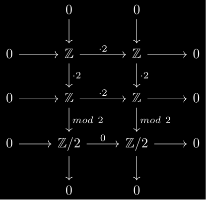

# Introduction

The objective of this post is to decide if a "simple" topological space can be "similar" to a "simple" and "easily describable" one. In more technical terms, we want to determine if a given CW-Complex can be homotopy equivalent to a finite CW complex. This is interesting as finite CW complexes are easier to work with and have nicer properties such as being compact and having finitely generated homology groups. This is a first approximation to the problem of determining if a CW-complex is homotopy equivalent to a compact manifold.

I will ommit the definition of basic concepts in Algebraic Topology such as CW-complexes, homotopy equivalences and fundamental groups. If at some point I make a post on basic algebraic topology I will link it here as a prerequisite.

# Wall's finitness obstruction on chain complexes

We now proceed to define a similar result in chain complexes that will be easily generalized to topological spaces.

## Finite domination of chain complexes

We start introducing notation for chain complexes:


Let $R$ be a ring. We say a $R$-chain complex $C_*$ is:

<ul>
<li><strong>finitely generated</strong> if each $C_n$ is a finitely generated $R$-module.</li>
<li><strong>projective</strong> if each $C_n$ is a projective $R$-module.</li>
<li><strong>free</strong> if each $C_n$ is a free $R$-module.</li>
<li><strong>positive</strong> if $C_n = 0$ for $n < 0$.</li>
<li><strong>finite dimensional</strong> if $C_n = 0$ for $n > N$ for some $N \in \mathbb{N}$.</li>
<li><strong>finite</strong> if it is finitely generated and finite dimensional.</li>
</ul>




Let $R$ be a ring. We say a $R$-chain complex $C_*$ is **finitely dominated** if there exists a finite free $R$-chain complex $D_*$ and chain maps $i_*: C_* \to D_*$ and $r_*: D_* \to C_*$ such that $r_* \circ i_*$ is chain homotopic to the identity on $C_*$.

In this case we say $(D_*, i_*, r_*)$ is a **finite domination** of $C_*$.


Let's start with a simple example of a finitely dominated chain complex that is not finite:


Consider the $\mathbb{Z}$-chain complex $C_*$ defined as follows:

$$0\xrightarrow{} \bigoplus_{i=1}^{\infty}\mathbb{Z}\xrightarrow{id} \bigoplus_{i=1}^{\infty}\mathbb{Z} \xrightarrow{} 0$$

where $C_0 \cong C_1 \cong \bigoplus_{i=1}^{\infty}\mathbb{Z}$. Notice that this chain complex is finitely dimensional but not finitely generated so it is not finite.
However, it is finitely dominated as we can take $D_*$ to be the 0 chain complex:

$$D_n = 0 \text{ for all } n.$$

We can define $i_*: C_* \to D_*$ and $r_*: D_* \to C_*$ as the zero maps. Then $(D_*, i_*, r_*)$ is a finite domination of $C_*$.

Indeed, it is enough to check that $r_* \circ i_*=0_{C_*}$ is chain homotopic to the identity on $C_*$. That is, we need to find maps $h_n: C_n \to C_{n+1}$ such that

$$d^C_{n} \circ h_n + h_{n-1} \circ d^C_{n-1} = id_{C_n}-0_{C_n} \text{ for all } n.$$

As the only non-zero $C_n$ are $C_0$ and $C_1$, we only need to check the cases $n=0$ and $n=1$. 

If we define $h_0: C_0 \to C_1$ as the identity map and $h_n = 0$ for all $n \neq 0$. Then we have:
$$\begin{align*}
d^C_{0} \circ h_0 + h_{-1} \circ d^C_{-1} = id \circ id + 0 \circ 0 &= id_{C_0} \\
d^C_{1} \circ h_1 + h_{0} \circ d^C_{0} = 0 \circ 0 + id \circ id &= id_{C_1}
\end{align*}$$



## Wall's finitness obstruction for chain complexes

To define the finitness obstruction we need one final result:


Let $C$ be a chain-complex. $C$ has a finite domination if and only if $C$ is chain homotopy equivalent to a finite projective chain complex.


Using this theorem we can finally define the finitness obstruction:


Let $C_*$ be a $R$-chain complex with a finite domination $(D_*, i_*, r_*)$ where $D_*$ is a finite projective $R$-chain complex. We define the **finitness obstruction** $o(C_*)$ as 
$$o(C_*) = \sum_{n} (-1)^n [D_n] \in K_0(R)$$
where $[D_n]$ is the class of the projective module $D_n$ in the projective group $K_0(R)$.


One last, and more relevant, definition remains:


Let $C_*$ be a $R$-chain complex with a finite domination $(D_*, i_*, r_*)$ where $D_*$ is a finite projective $R$-chain complex. We define the **reduced finiteness obstruction** $\tilde{o}(C_*)$ as 
$$\tilde{o}(C_*) = \sum_{n} (-1)^n [D_n] \in \tilde{K_0}(R)$$
where $[D_n]$ is the class of the projective module $D_n$ in the reduced projective group $\tilde{K_0}(R)$.


In particular, the reduced finitness obstruction is the image of the finitness obstruction under the natural projection $K_0(R) \to \tilde{K}_0(R)$.

In the previous example we have $o(C_*) = 0$ because $D_n = 0$ for all $n$ (Because $D_*$ is already a finite projective chain complex it can be used for the computation).

## Examples and computations

It is in general very hard to compute the finitness obstruction of a chain complex. However, if we find that the projective group $K_0(R)$ is trivial, then we can conclude that the finitness obstruction of any $R$-chain complex is trivial. Equivalently, if the reduced projective group $\tilde{K}_0(R)$ is trivial, then the reduced finitness obstruction of any $R$-chain complex is also trivial.


Let $C_*$ be a $\mathbb{Z}[\mathbb{Z}/2]$-chain complex with a finite domination. As $K_0(\mathbb{Z}[\mathbb{Z}/2]) \cong \mathbb{Z}$, we have that $o(C_*) = [\mathbb{Z}^n]$ for some $n \in \mathbb{Z}$. However, as $\tilde{K}_0(\mathbb{Z}[\mathbb{Z}/2]) = 0$, we have that $\tilde{o}(C_*) = 0$.


It can be usefull to have more powerfull results to calculate the finitness obstruction.


<ol>
<li>
If a $R$-chain complex $C_*$ is chain homotopy equivalent to a finitely dominated $R$-chain complex $D_*$, then $C_*$ is finitely dominated and 
$$o(C_*) = o(D_*).$$
That is, the finitness obstruction is a homotopy invariant.
</li>
<li> Let $0 \to C_* \to D_* \to E_* \to 0$ be a short exact sequence of $R$-chain complexes. If two of the chain complexes are finitely dominated, then the third one is also finitely dominated and
$$o(D_*) = o(C_*) + o(E_*).$$
That is, the finitness obstruction is additive on short exact sequences.
</li>
<li> Let $C_*$ be a finitely dominated $R$-chain complex, then $\tilde{o}(C_*) = 0$ if and only if $C_*$ is chain homotopy equivalent to a finite free $R$-chain complex.
</ol>


